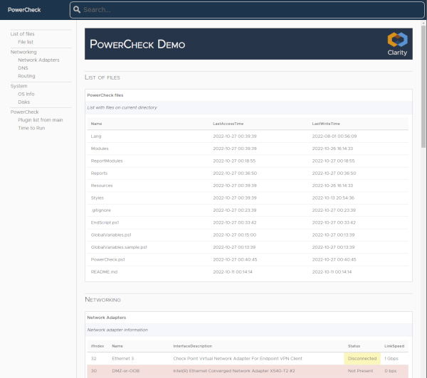

# Introduction

PowerCheck is inspired by Alan Renouf [vCheck](https://github.com/alanrenouf/vCheck-vSphere), it keeps the same functionality and modularity, making some improvements.

- Only one copy of PowerCheck is required to run multiple reports
- Hierarchical folder structure resources are loaded from PowerCheck root folder and then from the plugin folder
- Ability to save reports in JSON format



# Table of contents

* [Requirements](#requirements)
* [Usage](#usage)
* [Configuration](#configuration)
* [Roadmap](#roadmap)

# Requirements

PowerShell

# Usage

To run PowerCheck enter the directory where ``PowerCheck`` was downloaded to and run the command below, to run the demo report.

```powershell
.\PowerCheck.ps1 -Plugin Demo
```

When passing just the plugin name PowerCheck looks for a folder with the name passed in to the ``-Plugin`` argument in the ``Plugins`` folder inside PowerCheck and in the parent folder (..\Plugins). If the plugin is located in a different location altogether then the full path to the plugin can be used instead.

```powershell
.\PowerCheck.ps1 -Plugin c:\PowerCheckPlugins\Demo
```

# Setup

## Configuration

Configuration can be done by manually editing ``GlobalVariables.ps1``, or through a setup wizard, which can be enabled by setting the ``$SetupWizard`` variable to true in the ``GlobalVariables.ps1`` of the PowerCheck folder or in the plugin folder.

```powershell
# Set the following to true to enable the setup wizard for first time run
$SetupWizard = $true
```

The setup wizard can also be ran by running PowerCheck with ``-SetupWizard [Full|Global|Plugin]`` to edit All, PowerCheck or Plugin GlobalVariables.ps1 configuration file. This will also trigger PowerCheck to check each script file.

## Restoring default configuration

If the PowerCheck ``GlobalVariables.ps1`` gets corrupted or lost, it can be recreated by running.
```powershell
.\PowerCheck.ps1 -ResetGlobalConfig
```
This will recreate the default ``GlobalVariables.ps1`` configuration file, overwriting the existing file.

Note that this will not affect the individual plugin ``GlobalVariables.ps1``.

## User variables

User variables can be set on each individual script and in the plugin ``GlobalVariables.ps1`` file, this permits each plugin to have different settings.

In order for PowerCheck to know what variables to present to the user when running the setup wizard, it will only consider variables inside the ``# Start of Settings`` and ``End of Settings`` block and each the line before each variable is a comment, which will be used to prompt to the user.

```powershell
# Start of Settings

# Name of the server to connect to.
$server_name = "localhost"

# End of Settings
```
The above configuration file would result in the following prompt while running the configuration wizard.
```
Name of the server to connect to. (localhost) [script]:
```

# Report plugins

Report plugins are made of one or more powershell scripts, which can return a single object to be displayed in the report.

## Folder structure

```
\
│   EndScript.ps1
│   GlobalVariables.ps1
├───lang
│   ├───en-US
│   │       10 Time.psd1
│   │
│   └───pt-PT
│           10 Time.psd1
├───scripts
│   │   10 Time.ps1
│   │   15 PsVersion.ps1
│   │
│   ├───10 List of files
│   │       10 List files.ps1
│   │       20 donotrun.ps1.disabled
│   ├───20 Networking
│   │       10 adapters.ps1
│   │       20 dns.ps1
│   │       30 routing.ps1
│   └───50 System
│           10 System.ps1
│           20 Disks.ps1
├───reports
└───styles
```

### Plugin root

The plugin root folder can contain the following two files

- **GlobalVariables.ps1**: Allows overwriting any variable set in the PowerCheck ``GlobalVariables.ps1``; a good example is to set the ``$ReportTitle`` so each plugin has its own title.
- **EndScript.ps1**: This script will be executed after all other scripts in the plugin and the ``EndSCript.ps1`` in the PowerShell folder. A recommendation is to use this to disconnect from any server or service. It is possible also to modify the report data by modifying the ``$pluginData`` object.

### Lang

The lang (language) folder contains one of more child folders for each locale and plugin manifest files (.psd1) for the script localized messages.
In the Demo plugin the script ``10 Time.ps1`` can have its messages displayed in English (en-US) or Portuguese (pt-PT).

If present PowerCheck will first apply the en-US messages than then overwrites each message with the messages from the chosen locale.

### Scripts

The scripts folder contains the PowerShell script to be executed; these can be grouped together in folders or in the root of the scripts folder.
PowerCheck will run the scripts in alpha numeric order, sorting the scripts directly inside the scripts folder then sorting all the child folders and finally the scripts inside each folder. This permits to define a predictable order in which the scripts will run.

Unless otherwise specified by the script all variables defined in the script are global variables and accessible to the following scripts. This is useful if multiple scripts need to get data from the same application; this allows having an initialization script which connects VMware vCenter for example and then having other scripts to get information about hosts, vms, datastores, etc.

### Styles 

The styles folder can be used to customize the report to make it a bit different that other reports based on the same style, or to make a style available to a specific plugin. Any file inside the plugin styles folder will be preferred to the file with the same name on the PowerCheck styles folder.

# Styles

PowerCheck styles are generated by a simple HTML parsing engine which looks for specific attributes and replaces its content with the appropriate data. As the HTML template is parsed as a XML file all HTML tags must be properly closed, for example ``<br>`` would cause PowerCheck to throw and error, but ``<br/>`` is closed and would not throw an error.

PowerCheck attributes can be **element**, **val** and **attr**.

## element

### script-list

The scripts-list element represents the parent html tag to which PowerCheck will copy its children and duplicate once for each script to be displayed, consider this as a for-each-script.

Consider the following for a plugin with three scripts
```html
<div powercheck="element:scripts-list">
  <h3>Hello World</h3>
  <span powercheck="val:script-comments"></span>
  <p>Have a nice day</p>
</div>
```

the following HTML would be generated
```html
<div>
  <h3>Hello World</h3>
  <span>Script 1 comment</span>
  <p>Have a nice day</p>
  <h3>Hello World</h3>
  <span>The comment from another script</span>
  <p>Have a nice day</p>
  <h3>Hello World</h3>
  <span>And just one more comment</span>
  <p>Have a nice day</p>
</div>
```

### menu

The other possible value for element is menu, and it is used as the root html tag for the list with the name of the scripts. This element is removed when the report is sent in the email body.
Note that the actual list with the script scripts is added with ``val:navlist``, see below.

#
## val

The val tag replaces the html tag inner text as follows:

- report-header: The report header (PowerCheck)
- report-title: Global variable $ReportTitle, to be added as the HTML page title
- group-name: The name of the folder for each group of scripts in the scripts folder
- script-header: Header ($header) of the script script
- script-comments: Comments ($comments) of the script script
- script-data: The result of the script script as a HTML table
- navlist: Adds the list item (li) tags for the $Title of each script

#
## attr

Adds an attribute and value to the HTML tag, and it is added as a key value pair (attr:key:val), where key is the name of the attribute and value it’s the content.

Add and attribute (key) and value (val) to the HTML tag. Currently the only dynamic value is ``script-id``, which is an index of the scripts that have returned data in the HTML report

```html
<a powercheck="attr:name:script-id"></a>
```

```html
<a name="script-1">
```

**script-display:script-id**: this will mark the HTML tag that will be hidden (display:none) by the search function if no matches are found inside the table (val:script-data).

## Searchbar

When the report is generated as an HTML file to be displayed in a browser, the report can include a searchbar to search and nightlight text in the report. In order for PowerCheck to be able to create the report with the search bar two HTML tags need to be included in the ``main.html`` template. First a ``<search />`` HTML tag needs be added to the ``<head></head>`` section, ideally before loading the custom.css style, so it can overwrite and customize the searchbar if required. A HTML tag with an id attribute equal to **searchbar** (for example ``<input id="searchbar"></input>``), which will be replaced with the searchbar when the HTML document is loaded.

# Roadmap

- [ ] Add authentication when sending emails
- [ ] PowerShell for Linux
